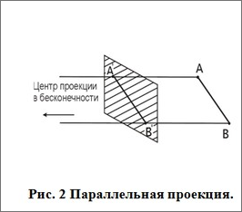

# 28. Плоские проекции и их получение
## Определение проекции 

**Проекция объекта** размерности N – это его изображение в пространстве меньшей размерности (например, из 3D в 2D, или из 4D в 3D), полученное путем «сжатия» или "отбрасывания" одной или нескольких координат, сохраняя при этом существенные характеристики формы и положения относительно проекционной плоскости или направления

### Параллельные проекции

- Параллельные проекции фиксируют истинные размеры изображения до некоторого множителя 
	(коэффициент искажения зависит от наклона отрезка к плоскости проекции. Если отрезок параллелен плоскости, его длина проецируется в натуральную величину (k=1). 
- Параллельные линии при параллельном проецировании остаются параллельными. 
- Углы сохраняются на тех гранях которые параллельные проекционной плоскости
1. Аксонометрические![[Pasted image 20260115123430.png]]
	Также существуют триметрическая проекция, где коэффициент искажения по всем трем осям и углы между ними разные
2. Ортографические
	![[Pasted image 20260115135002.png]]
	Виды спереди, сбоку, сверху получаются путем "отбрасывания" одного из измерения осей
3. Косоугольные проекции
	Проецирующие лучи падают на плоскость под **острым углом** (отличным от 90∘). Это позволяет передать объем, сохраняя одну из граней предмета без искажений (в натуральную величину).
	- **Фронтальная изометрическая проекция (Проекция Кавалье):**
	    - Ось Z вертикальна, ось X горизонтальна.
	    - Ось Y (уходящая вглубь) обычно под углом 45∘.
	    - **Важно:** Масштаб по всем осям 1:1. Из-за этого деталь часто кажется чересчур «толстой» или растянутой в глубину.
        
	- **Фронтальная диметрическая проекция (Кабинетная проекция):**
	    - Расположение осей такое же, как в Кавалье (45∘ для оси Y).
	    - **Важно:** Масштаб по оси Y сокращается в два раза (1:2). Это делает изображение визуально более естественным для человеческого глаза, поэтому её часто называют «кабинетной».